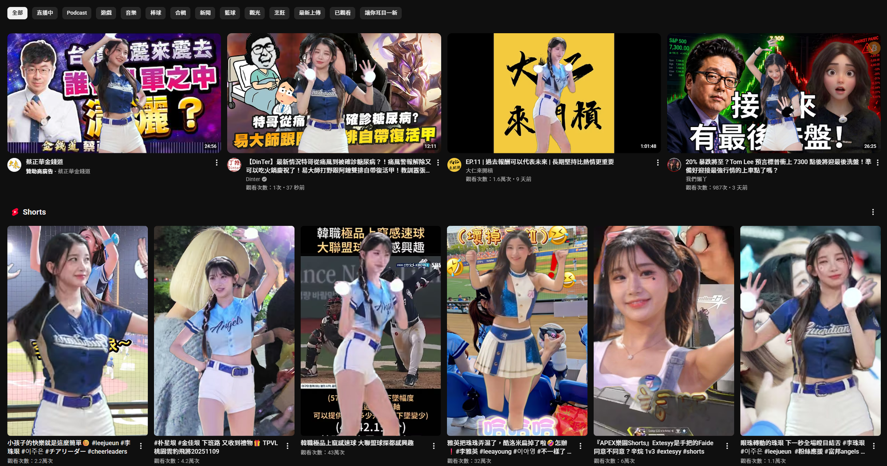

# YouTube JuEunBeautify

Overlays images of 李珠珢 (JuEun) on every YouTube video thumbnail.



Based on [MrBeastify-Youtube](https://github.com/MagicJinn/MrBeastify-Youtube).

## Install

**Chrome:** Load via `chrome://extensions` → Developer mode → Load unpacked

**Firefox:** Load `manifest.firefox.json` via `about:debugging` → This Firefox → Load Temporary Add-on

## Prepare Images

1. Install dependencies:

```bash
pip install -r requirements.txt
```

2. Choose a mode:

### Thumbnail mode — fetch YouTube cover image

```bash
python prepare_images.py <youtube_url> [<youtube_url> ...]
```

### Frames mode — extract frames from a video

```bash
python prepare_images.py --frames <youtube_url> [options]
```

| Option | Default | Description |
|--------|---------|-------------|
| `--fps 2` | 1 | Frames per second to extract |
| `--start 1m30s` | — | Start time (supports `1m30s`, `1:30`, `90s`, `90`) |
| `--end 2m` | — | End time |
| `--auto 6` | — | Auto-pick N best frames (no interaction needed) |
| `--pick 5,12,30` | — | Manually specify frame numbers to process |
| `--model birefnet-portrait` | birefnet-portrait | rembg model to use |

**Example:**
```bash
python prepare_images.py --frames https://www.youtube.com/watch?v=XXXX --start 10s --end 2m --auto 8
```

Output: `images/1.png`, `images/2.png`, ... (transparent PNG cutouts)  
Index: `images/count.json` is updated automatically.

## Image Format

- PNG with transparent background
- Naming: sequential integers starting from `1.png`
- Add image number to `images/flip_blacklist.json` if it contains text that looks wrong when mirrored

Example `flip_blacklist.json`:
```json
[2, 5]
```
